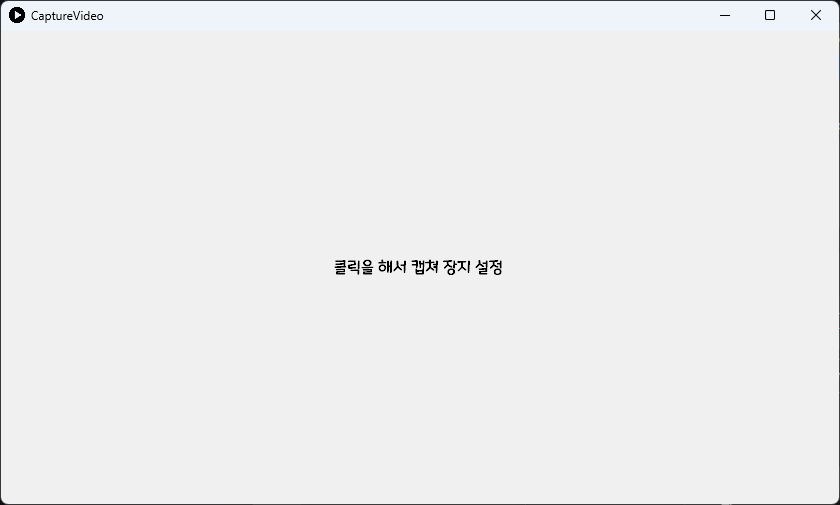
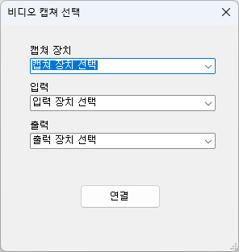
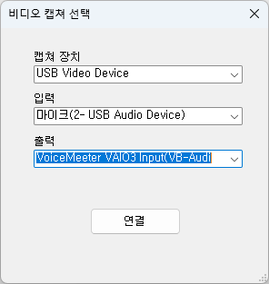
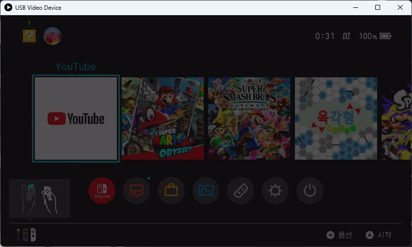

# CaptureVideo
아주 간단하게 캡쳐보드나 카메라를 프로그램에 띄우기.

Very simply launch the capture board or camera into the program.

## 사용방법

프로그램을 처음 켰을때의 화면

The screen when the program is first started

설정 화면(우클릭 하면 뜸)

Settings screen (right-click to open)

정상적으로 연결되면 뜨는 화면

The screen that appears when connected normally

### 주의 사항
하나의 캡처 장치를 여러 화면에서 열 수 없습니다.

One capture device cannot be opened in multiple screens.

## 필요 요구사항
.Net Framework 4.8
